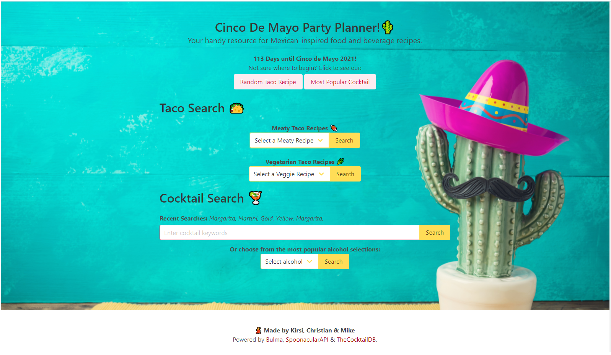

# APIGroupProject - Cinco De Mayo Party Planner

Deployed Websute URL: https://kirsralk.github.io/APIGroupProject/
GitHUB repository URL: https://github.com/kirsralk/APIGroupProject/
Screenshot: 
Screenshot (Mobile): 

## Description
1- This App generates recipes and beverages in preperation for Cinco De Mayo.
2- The App first feature is the countdown til Cinco De Mayo (May 5, 2021).
3- The App offers the possibility of generating a random recipe for a large variety of tacos.
4- The App offers the possibility of generating a random beverage and its ingredients.
5- The App procceeds to two taco categories; displaying meat tacos, and then vegetarian. These options will be chosen by recipe name and once selected, the results are displayed
   at the bottom of the page.
6- The Apps final function offers the option of searching through our choices of beverages. To do so you can eather type a keyword or choose a common ingredient from our dropdown list.
   Once the user has selected or entered an option, the beverage name, picture, instructions and ingredients are displayed.
7- To organize the app you can close all results searched to return to the default display of the web page.
8 - Local storage saves the user's searches.  Our algorithm displays a notification if no results are found for a given search.

## User Story

```
AS A person hosting a Cinco De Mayo (Mexican themed) party
I WANT to see food and drink recipes
SO THAT I can plan what to buy for my party
```

## Application Requirements

* Use a CSS framework other than Bootstrap.
* Be deployed to GitHub Pages.
* Be interactive (i.e., accept and respond to user input).
* Use at least two server-side APIs.
* Does not use alerts, confirms, or prompts (use modals).
* Use client-side storage to store persistent data.
* Be responsive.
* Have a polished UI.
* Have a clean repository that meets quality coding standards (file structure, naming conventions, follows best practices for class/id naming conventions, indentation, quality comments, etc.).
* Have a quality README (with unique name, description, technologies used, screenshot, and link to deployed application).
